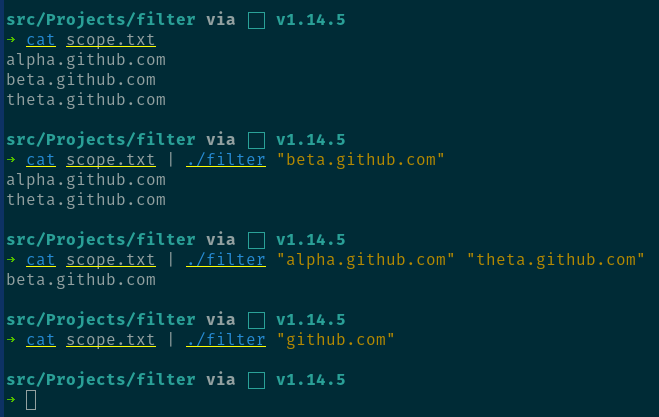

# Filter

Filter filters any line submitted over standard input against regular expression filters. It was built to filter out of scope domains from a set of potentially scoped domains.

## Example Usage

